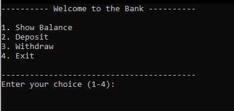

# 🏦Simple Banking Program

A beginner friendly Python console application that simulates basic banking operations like deposit, withdraw, and balance checking.

⚡ I’ll keep updating this project as I learn more in Python and add new features.

## 🚀Features

- Deposit money
- Withdraw money
- Check account balance
- Input validation for invalid amounts

## 📷Screenshots

## 📌Future Improvements

- Add user authentication 
- Save balances in a file or database
- Create a GUI version with Tkinter/PyQt
- Transaction History
- Multiple Accounts
## 👨‍💻Authors

- [@Pratik-1337](https://www.github.com/Pratik-1337)

